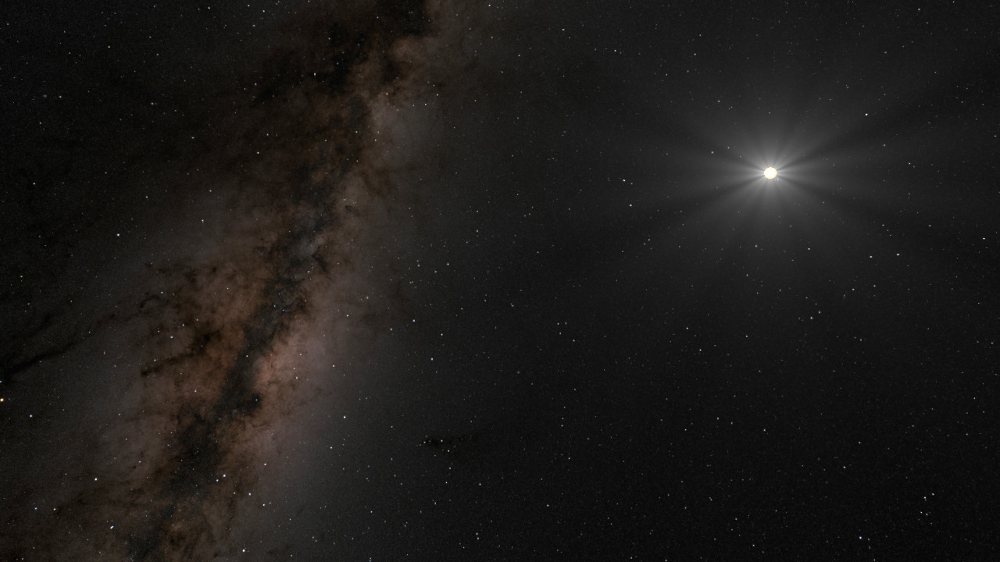
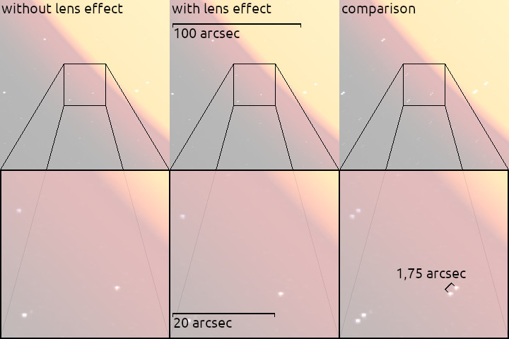

# black-hole
What would happen if our sun became a black hole? What would it look like? This is a little Vulkan project to visualize the effects of general relativity within our solar system.

## General relativity

Gravity not only has an effect on objects with mass but also on light. The reason for this is founded in Einsteins general theory of relativity. This theory also predicts the existance of black holes. Every object becomes a black hole if it is compressed strongly enough: As soon as the diameter of the object passes a certain threshold depending on the mass of the object, everything collapses into a singularity.

These theoretical considerations raise some natural questions.
1. Can our sun become a black hole?
2. What would this threshold be in that case?
3. What would it look like?
4. Can we see or measure the effects of our sun's gravity?

The answer to the first question is most definately NO, which should become apparent when ansering the second question. The formula for the so-called Schwarzschild radius, the radius an object must must have to become a black hole, is given by

r = 2 G m / c².

Here, G is the gravitational constant, given by 6.67430×10⁻¹¹ m³ / kg s², m is the mass of the object, e.g. our sun's mass is roughly 2 × 10³⁰ kg, and c is the speed of light which is about 300.000 km / s. If you put these all together you will calculate our sun's Schwarzschild radius as 2.97 km. While 3 km seems to be quite a lot, just picture that the radius of our sun is actually more than 200,000 times larger.

Yet, this does not stop the curious mind from asking the third question which is one reason I wrote this program.

## The program

The maths behind general relativity is quite involved and does not always admit exact calculations. There is, however, a reasonably simple formula that approximates the effects gravity has on light beams that do not travel to close from the centre of gravity.

I coded all the physical constants, distances, masses, etc into a program and implemented a shader using the approximation formula I mentioned above. At first the result may be a bit unsatisfactory. The reason is that I visualized the black hole to have the same distance to Earth as our sun. In that case, however, the black holes effect on its surroundings is so very diffucult to see. Only if one zooms in beyond the point the star texture blurs out completely, the effects become visible.

The following video shows a black hole as it would look like if the sun would have collapsed. It starts with the view we would have from Earth zooms in by a factor of 2 every second.

I think this already looks pretty amazing. But what would a larger black hole look like? Say, a black hole whose Schwarzschild radius matches the radius of our sun? If such a black hole would pass Earth within the same distance Earth has to the sun and with roughly the speed of light, then we could, with naked eyes, see the following night sky.

## Being more realistic

As we saw in the first video, one has to look very closely to see the effects of our sun's gravity. So, is it possible to measure the effect nonetheless? The answer is YES. In early days, scientists waited for a total solar eclipse in order to look at the stars that are positioned near the sun without the disturbing sunlight.

Within this program we don't need to simulate an eclipse to compare the sky with and without the sun's gravitational effect on it. It is also particular easy, as we can turn on and off the relativistic effects by simply pressing a key.

One problem, however, remained. The sky texture, though having measurements of amazing 16384 × 8192 px, does not admit enough details to make the effects visible. Yet, if we scale down the texture within the shader, this obsticle can be overcome.

Calculations show that our sun's gravity is able to distort the light of stars behind it by roughly 1.75 arcsec. (1° = 60 arcmin = 60 × 60 = 3600 arcsec.) Our sun has an angular diameter of approx. 0.5° = 1920 arcsec. We therefore have to look very closely at the sun to notify the distortion. Yet, whendoing so, we see the following.

## Plans for the future

I'd love to visualize more relativistic effects, e.g. the space distortion when travelling with almost the speed of light. Also I already began to implement Newton's Laws of gravitation in order to simulate the orbits of the planets in our solar system. Another cool thing wo visualize would be the accretion disk around a black hole.

I think there are still many interesting ideas to experiment with.